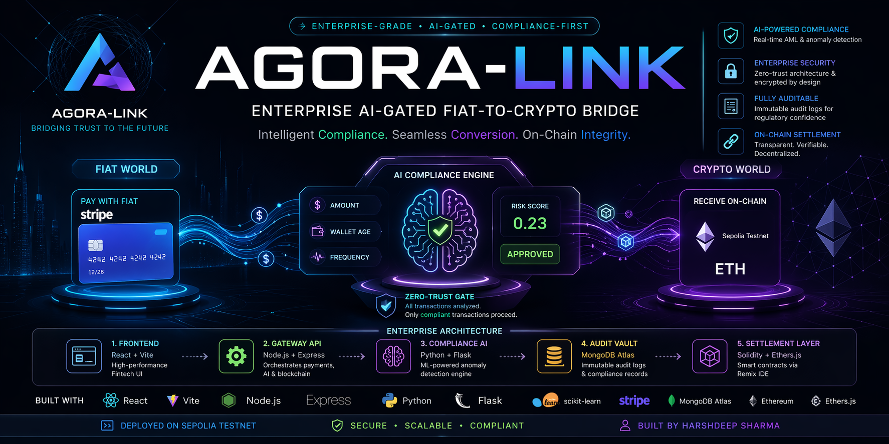
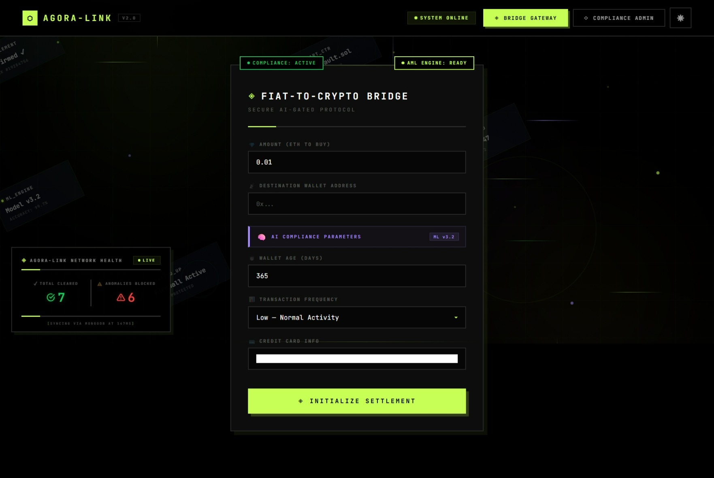
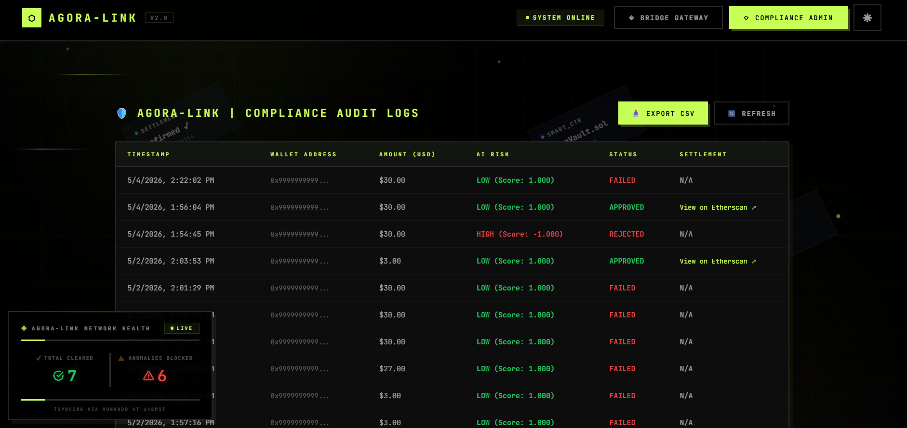
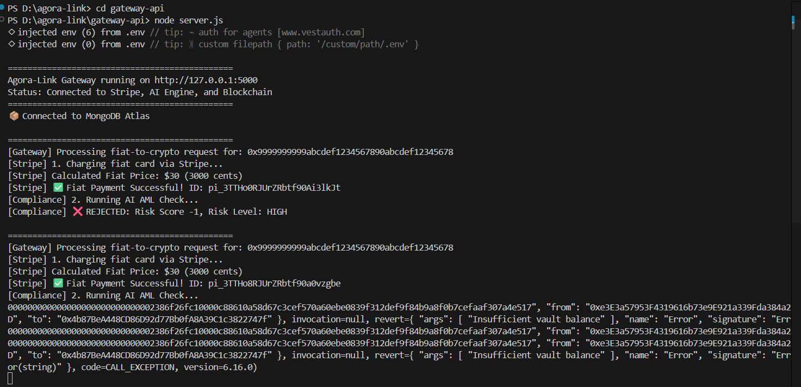

# 🚀 AGORA-LINK: Enterprise AI-Gated Fiat-to-Crypto Bridge



**Author:** Harshdeep Sharma  
**Version:** 1.0.0 (Stable Release)  
**Deployment:** Sepolia Testnet | MongoDB Atlas | Python ML Engine  

---

## 🌐 The Vision

Agora-Link is built to solve one of the biggest challenges in decentralized finance — **the Compliance Gap**.

Unlike traditional bridges that focus only on speed, Agora-Link prioritizes **institutional integrity**, acting as a secure, auditable, and intelligent **financial gatekeeper** between:

- Web2 Fiat Systems (Stripe)
- Web3 Liquidity (Ethereum)

It uses an **Agentic AI Compliance Engine** to ensure every transaction is verified before execution.

---

## 📸 System Walkthrough

### 1. The Fiat On-Ramp (React + Stripe)
*Secure Web2 entry point capturing fiat intent via Stripe Elements.*
 

### 2. AI Compliance Dashboard 
*Real-time monitoring of Isolation Forest anomaly detection and transaction risk scores.*


### 3. Automated Web3 Settlement (Sepolia Testnet)
*Successful Node.js gateway payout triggered post-AI verification.*1


---

## 📺 Project Demo Video
Watch the 5-minute technical walkthrough demonstrating the "founder mindset", functional prototype, and backend architecture.

<video src="./assets/Agora-Link-bridge.mp4" controls width="100%"></video>

---
## 🏗️ System Architecture

Agora-Link follows a **multi-layered microservices architecture** for security, scalability, and real-time AML detection.

### 1. Intelligent Frontend (React + Vite)
- Dark-mode fintech UI
- Secure payment handling via Stripe Elements
- Compliance Admin Dashboard for audit monitoring

### 2. Gateway API (Node.js / Express)
- Core orchestration layer
- Connects payments, AI engine, and blockchain
- Ensures **AI Approval Token validation** before transactions

### 3. Compliance AI Engine (Python / Flask)
- ML-based anomaly detection using **Isolation Forest**
- Evaluates:
  - Transaction amount
  - Wallet age
  - Transaction frequency
- Generates real-time **Risk Score**

### 4. Audit Vault (MongoDB Atlas)
- Immutable-style logging system
- Stores both approved and rejected transactions
- Enables regulatory audit tracking

### 5. Web3 Settlement Layer (Solidity + Ethers.js)
- Smart contracts deployed via Remix IDE
- Lightweight and optimized blockchain interaction
- Secure settlement logic on Ethereum (Sepolia)

---

## 🛠️ Tech Stack

| Layer | Technology | Purpose |
| :--- | :--- | :--- |
| **Frontend** | React.js, Vite, Tailwind CSS | High-performance, responsive UI |
| **Backend** | Node.js, Express.js | API orchestration & webhook handling |
| **AI / ML** | Python, Scikit-Learn | Behavioral anomaly detection |
| **Web3** | Solidity, Ethers.js | Smart contract interaction & signing |
| **Database** | MongoDB Atlas | Immutable audit logging |
| **Payments** | Stripe API | Secure fiat-to-crypto tokenization |
---

## 🛡️ Security Features

- **Zero-Trust AML System**
  - Transactions blocked if risk score > **0.85**

- **Environment Isolation**
  - Sensitive keys stored in `.env`
  - No exposure to version control

- **Admin Protection**
  - Secured Compliance Dashboard (password-protected)

- **On-Chain Verification**
  - Each transaction linked with a verifiable hash (Etherscan)

- **Hybrid Deployment:** 
  - Smart contracts were compiled and deployed via a cloud-based EVM (Remix IDE) to bypass local dependency conflicts and maintain rapid development velocity.
---

## ⚙️ Execution Guide

### Prerequisites
Ensure you have the following installed before running the project:
* Node.js (v18+)
* Python (v3.8+)
* MongoDB Atlas Account
* Stripe Developer Account (Test Mode)
* MetaMask Wallet (Connected to Sepolia)

### Environment Variables
Create a `.env` file in the root of your `gateway-api` and add the following keys:
```env
PORT=5000
STRIPE_SECRET_KEY=your_stripe_test_key
MONGODB_URI=your_mongodb_connection_string
SEPOLIA_RPC_URL=your_alchemy_or_infura_url
PRIVATE_KEY=your_metamask_private_key
CONTRACT_ADDRESS=your_deployed_vault_address


Run all three core services simultaneously.

---

### 1️⃣ Compliance Engine (Python)

```bash
cd compliance-engine
pip install flask flask-cors pandas scikit-learn
python app.py
```
Runs on: [http://127.0.0.1:5001](http://127.0.0.1:5001)

### 2️⃣ Gateway API (Node.js)

```bash
cd gateway-api
npm install
node server.js
```
Runs on: http://localhost:5000

### 3️⃣ Client UI (React)

```bash
cd client-ui
npm install
npm run dev
```
Runs on: http://localhost:5173

### Smart Contract Setup (Optional)

The AgoraVault smart contract is currently live on the Sepolia Testnet. By default, the Node.js gateway is configured to interact with this pre-deployed instance.

If you wish to deploy your own instance of the vault:

- Navigate to the `contracts/` directory in this repository and copy the `AgoraVault.sol` code.

- Open Remix IDE.

- Create a new file, paste the Solidity code, and compile it.

- Go to the "Deploy & Run Transactions" tab, set the Environment to Injected Provider - MetaMask (ensure you are on the Sepolia network).

- Deploy the contract and copy your new contract address.

Update the CONTRACT_ADDRESS variable in your .env file with the new address.

## 📊 Administrative Dashboard
Agora-Link includes a built-in Compliance Dashboard:

📡 Real-time transaction monitoring
📜 Full audit trail from MongoDB
📤 One-click CSV export for compliance reporting

## License & Disclaimer

Developed by Harshdeep Sharma during the 2026 Advanced Fintech Sprint.

This project is intended for:

Industrial demonstration
Research and learning purposes

All smart contracts are deployed via Remix IDE for optimized gas efficiency and precision.